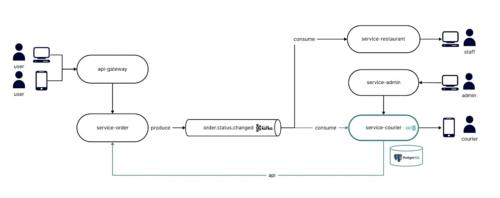

# service-courier

Backend-сервис для управления курьерами и доставками. Предоставляет HTTP API для работы с курьерами и назначениями, хранит данные в PostgreSQL. Обрабатывает события заказов из Kafka, обновляет статусы доставок и выполняет фоновую бизнес-логику. Поддерживает базовую наблюдаемость и мониторинг.

## Архитектура

Ниже представлена общая схема системы.



## Стек

- Язык: Go  
- API: HTTP, gRPC  
- БД: PostgreSQL  
- Брокер сообщений: Kafka
- Миграции: goose  
- Тесты: testify, go.uber/mock (mockgen)  
- Метрики: Prometheus  
- Мониторинг: Grafana  
- Профилирование: pprof  
- Контейнеризация: Docker, Docker Compose

## Запуск

1. Скопируйте `.env.example` в `.env` и при необходимости отредактируйте значения.
2. Поднимите сервис:

```bash
docker compose up --build -d
```

Если сети `infrastructure_default` нет, создайте ее:

```bash
docker network create infrastructure_default
```

## Важно

Этот микросервис является частью общей микросервисной архитектуры, поэтому для полноценной работы нужно запустить все связанные сервисы.

Если подняты `postgres`, `service-courier` и применены миграции, будет работать базовый HTTP API (курьеры, назначение/снятие через ручные запросы).

Событийная обработка заказов корректно работает только при запущенных внешних зависимостях.

Нужно отдельно запустить:

- `service-order`
- Kafka (с топиком `order.status.changed`)

## Миграции

Перед работой сервиса нужно применить миграции:

```bash
go install github.com/pressly/goose/v3/cmd/goose@latest
goose -dir migrations postgres "$GOOSE_DBSTRING" up
```

